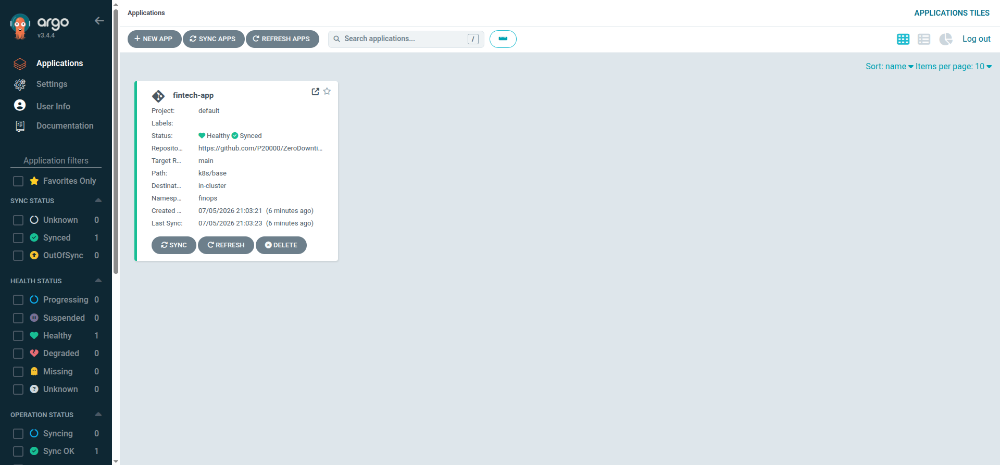
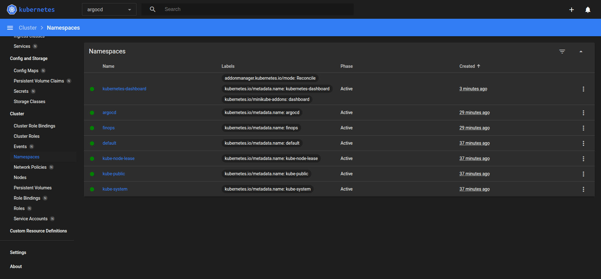

# AuraFinance: Mock Fintech Dashboard with Telemetry

A mock fintech dashboard built for small businesses to track cash flow, manage mock invoices, and view real-time transaction feeds. This application serves as the fullstack workload for testing our **Zero-Downtime Progressive Delivery & GitOps Pipeline**.

## Architecture Overview

```
                        ┌──────────────────┐
                        │   Web Browser    │
                        │ (React Frontend) │
                        └────────┬─────────┘
                                 │
                                 │ HTTP / SSE
                                 ▼
                        ┌──────────────────┐
                        │   Nginx Proxy    │
                        │ (Frontend Port)  │
                        └────────┬─────────┘
                                 │
                       ┌─────────┴─────────┐
                       │                   │
                       ▼                   ▼
             ┌──────────────────┐ ┌──────────────────┐
             │   Node.js API    │ │    Prometheus    │ Scrapes /metrics
             │ (Backend Port)   │ │  (Telemetry Port)│◄────────────────┐
             └──────┬─────┬─────┘ └──────────────────┘                 │
                    │     │                                            │
           Postgres │     │ Redis Pub/Sub                              │
                    ▼     ▼                                            │
             ┌──────────┐ ┌──────────┐                                 │
             │ Database │ │ Cache/MQ │                                 │
             └──────────┘ └──────────┘                                 │
                                                                       │
             (Background Traffic Simulator) ───────────────────────────┘
```

1. **Frontend (React + Vite):** A responsive dark-themed dashboard. Retrieves invoice and cash flow data, connects to backend Server-Sent Events (SSE) for real-time transaction updates, and contains controls to inject simulated errors.
2. **Backend (Node.js + Express):** Serves JSON endpoints, generates background transaction traffic to mock real business activity, runs SSE streams, and exports Prometheus metrics.
3. **Database (PostgreSQL):** Stores persistent financial transactions and invoice states.
4. **Cache & Stream (Redis):** Orchestrates transaction pub/sub triggers to push immediate updates to SSE clients.
5. **Observability (Prometheus):** Periodically scrapes `/metrics` endpoint from the backend to track request volume, errors, and latencies.

## Telemetry and DevOps Features

- **Background Simulator:** The backend automatically generates dummy transactions every 6 seconds. This guarantees active, real-world-style traffic patterns.
- **Prometheus Metrics Endpoint:** The backend exposes raw metrics at `/metrics` using `prom-client` including custom metrics:
  - `http_requests_total`: Counter tracking requests by method, route, and status code.
  - `http_request_duration_seconds`: Histogram measuring HTTP latencies.
  - `fintech_transactions_total`: Counter tracking types of transaction events (inflow/outflow).
  - `active_sse_connections`: Gauge tracking active client dashboards.
- **Simulate Backend Errors Switch:** The frontend dashboard includes a DevOps switch. Enabling it forces the backend to return `500 Internal Server Errors` for 60% of all requests. This allows you to easily simulate a failing deployment and trigger an automated canary rollback in Kubernetes!

## Running the Application Locally

Prerequisites: Ensure you have **Docker** and **Docker Compose** installed.

1. Clone or navigate to the directory.
2. Start the composition:
   ```bash
   docker-compose up --build
   ```
3. Open the services in your browser:
   - **Frontend:** [http://localhost:8080](http://localhost:8080)
   - **Prometheus Console:** [http://localhost:9095](http://localhost:9095)
   - **Backend API:** [http://localhost:5000/api/health](http://localhost:5000/api/health)
   - **Raw Telemetry Metrics:** [http://localhost:5000/metrics](http://localhost:5000/metrics)

## Verification Checklist

- [ ] Connect to `http://localhost:8080` and verify the Live Connection dot is blinking green.
- [ ] Observe the transaction feed. It should automatically update with new inflow/outflow entries every 6 seconds.
- [ ] Create a new invoice and click the **Credit Card icon (Pay)**. The invoice status will update to `paid` and a new inflow transaction will instantly slide in.
- [ ] Query Prometheus at `http://localhost:9095` for the metric `http_requests_total` to see traffic.
- [ ] Flip the **DevOps Testing & Canary Rollback Controls** switch to active.
- [ ] Refresh the page or perform actions. Verify in the network tab or console that some requests fail, and check `http_requests_total{status_code="500"}` in Prometheus to see the error rate spike.


## Devops project stuff starts here: 

firstly i started the minikube locally in the main directory for running the project locally with right flags: 
```bash 
minikube start \
  --driver=docker \
  --cpus=4 \
  --memory=4096 \
  --extra-config=kubelet.fail-swap-on=false \
  --extra-config=kubelet.cgroup-driver=systemd
```
i used 4096 mb of ram because i've got 16 gigs of ram in my system. and i used 4 cores for minikube.

i simply checked the nodes status by running the command: 

```bash
kubectl get nodes
```

and this gave me: 

```bash
NAME       STATUS   ROLES           AGE     VERSION
minikube   Ready    control-plane   3m26s   v1.35.1
```
i then enabled the addons of ingress for minikube for using the ingress controller in this cluster. 
```bash
minikube addons enable ingress
kubectl wait --namespace ingress-nginx \
  --for=condition=ready pod \
  --selector=app.kubernetes.io/component=controller \
  --timeout=120s
```
these are the namespaces that we will use, first one is for finops which will have the project's own namespace and another one for the argocd for managing those manifests from kubernetes. 
```bash 
kubectl create namespace finops
kubectl create namespace argocd
```
here i won't use the apply statement in this creation of the argocd namespace because it contains some long text lines for CRDs and that would lead to an error in k8s. it would look like: 
```bash
kubectl create -n argocd -f https://raw.githubusercontent.com/argoproj/argo-cd/stable/manifests/install.yaml
```

and then i waited for the deployment of the argocd-server to be ready. note that this step ensures that there occurs no failure and if it has to occur then it would timeout by 5 minutes. 
```bash
kubectl wait --for=condition=available --timeout=300s deployment/argocd-server -n argocd
```

now that the installation of the argoCD is complete, we can move to making the rest of the contents. 

following is the argocd Structure that we have created : 

```bash 
k8s/
├── argocd-app.yaml              for  Tells Argo CD to watch your GitHub repo
└── base/
    ├── namespace.yaml
    ├── postgres/
    │   ├── config.yaml          for  ConfigMap + Secret for credentials
    │   ├── pvc.yaml             for  1Gi persistent volume for DB data
    │   └── deployment.yaml      for  Postgres pod + ClusterIP service
    ├── redis/
    │   └── deployment.yaml      for  Redis pod + ClusterIP service
    ├── backend/
    │   ├── configmap.yaml       for  Env vars (DB host, Redis URL, port)
    │   ├── rollout.yaml         for  Argo Rollout (20% → analysis → 50% → 100%)
    │   ├── service.yaml         for  Stable + Canary services for traffic split
    │   └── analysis-template.yaml  for  Prometheus health gate (auto-rollback!)
    ├── frontend/
    │   ├── deployment.yaml      for  Frontend pod + service
    │   └── ingress.yaml         for  Routes /api → backend, / → frontend
    └── prometheus/
        └── deployment.yaml      for  In-cluster Prometheus that AnalysisTemplate queries

```

now we will build the images that we will feed into the minikube through here: 

```bash 
eval $(minikube docker-env)
docker build -t fintech-backend:v1 ./backend
docker build -t fintech-frontend:v1 ./frontend
```
then we can simply push this repository to refresh from the repository state into the argo cd and so that we can create those resources.

after that we can run this command to get the argocd port started without any effort: 

```bash 
kubectl apply -f k8s/argocd-app.yaml
```
then don't forget to portforward at port 8181 from the argocd server 
```bash 
kubectl port-forward svc/argocd-server -n argocd 8181:443
```
note: add -d at the end for making it run in the background 

and the argocd will be avaialble at this place : 

https://localhost:8181 

in that link we can see that the fintech app dummy is running like so : 



we can also see the same from the minikube dashboard 
```bash 
minikube dashboard
```


now both of them are working fine, 